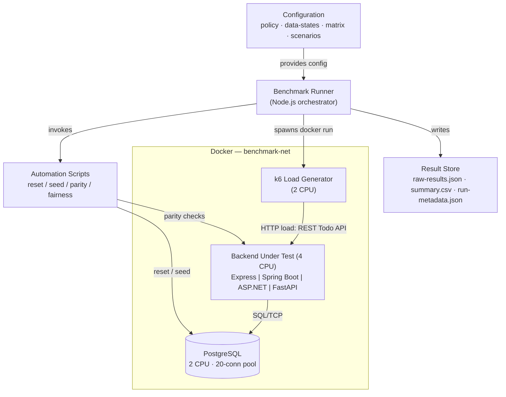
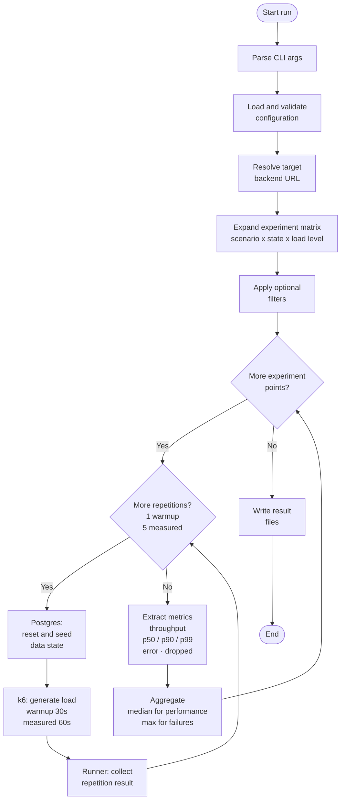

# Backend Benchmark Framework

A reproducible benchmarking framework for comparing **functionally equivalent REST backend implementations** built with different web frameworks. The focus is the **methodology** — how to measure fairly and reproducibly — applied as a case study to four backends that implement the same Todo API:

| Backend | Language / Runtime | Port |
| ------- | ------------------ | ---- |
| Express | Node.js | `3001` |
| Spring Boot | Java (JVM) | `8080` |
| ASP.NET | .NET | `8081` |
| FastAPI | Python (ASGI) | `8082` |

All backends share the same HTTP API contract, the same PostgreSQL schema, and the same runtime budget, so that measured differences reflect the **framework**, not the configuration. This repository accompanies a bachelor thesis on benchmarking methodology for web backend frameworks.

> This is an **end-to-end backend benchmark** (request parsing → validation → application logic → database access → serialization), not an isolated framework-overhead microbenchmark. The persistence layer is held constant across implementations and is part of the measured path.

---

## What it measures

- **Throughput** — requests per second
- **Latency** — p50 / p90 / p99
- **Error rate** — share of failed HTTP responses (aggregated by **max** across repetitions)
- **Dropped iterations** — generator-side load shedding under open-model overload (aggregated by **max**)

Performance metrics are aggregated by **median** (robust to outliers); failure metrics by **max** (so a single bad repetition is never hidden).

---

## Architecture



### Execution flow



Editable diagram sources (PlantUML + Mermaid) live in [`docs/diagrams/`](docs/diagrams).

---

## Fairness contract (Option B)

To keep the comparison fair, every backend runs under the same production-style runtime budget. The full contract is documented in [`docs/benchmark-fairness.md`](docs/benchmark-fairness.md) and verified by a preflight script.

| Resource | Setting |
| -------- | ------- |
| Backend container | 4 CPUs |
| PostgreSQL container | 2 CPUs |
| k6 container | 2 CPUs |
| Total DB connection pool | 20 per backend (e.g. Express/FastAPI: 4 workers × 5; Spring/ASP.NET: 20) |
| Network | container-to-container on `benchmark-net` |
| Load generator | k6 in Docker (`grafana/k6:2.0.0`) |

---

## Scenarios and load models

Each scenario is defined by an operation mix that sums to 100. Scenarios are executed under one of two **load models**:

- **Closed** (`constant-vus`): a fixed number of virtual users; load is self-throttling → measures the **throughput plateau** and latency growth.
- **Open** (`constant-arrival-rate`): a fixed request rate regardless of whether the backend keeps up → measures the **breaking point** (latency explosion, errors, load shedding).

| Scenario | Load model | Operation mix |
| -------- | ---------- | ------------- |
| `s1-read-only-paged` | closed | 80% keyset-paged list, 20% get-by-id |
| `s2-write` | closed | 100% create |
| `s3-mixed-crud` | closed | 55% paged list, 15% get-by-id, 15% create, 15% update |
| `s4-overload` | open | same mix as s1 |
| `s5-overload-write` | open | same mix as s2 |
| `s6-overload-mixed-crud` | open | same mix as s3 |

Collection reads use **keyset pagination** (`?limit=&afterId=`) so page cost is independent of table size. `DELETE` is implemented and parity-tested but excluded from the measured mixed workload (it would produce expected 404s that distort error rate).

**Data states** (seeded before each run): `empty` (0 rows), `small` (100), `medium` (10,000), `large` (100,000).

The full matrix expands to **48 experiment points per backend**.

---

## Repository layout

```text
backends/            # The four systems under test (express, springboot, aspnet, fastapi)
benchmark/
  config/            # benchmark-policy.json, data-states.json, experiment-matrix.json
  scenarios/         # s1..s6 workload definitions
  runner/src/        # Node.js benchmark runner
    execution/       #   experiment-runner, repetition-runner, run-k6 (Docker k6)
    results/         #   metrics, aggregate, result-writer
  runner/k6/         # workload.js executed inside the k6 container
  results/           # validation/ and official/ output (per backend, timestamped)
db/                  # init / reset / seed SQL
scripts/             # reset/seed, parity (compare-express-*), verify-benchmark-fairness
docs/                # project-documentation.md, benchmark-fairness.md, diagrams/
docker-compose.yml   # Postgres + four backends on benchmark-net
```

---

## Prerequisites

- Docker (Desktop) — runs the backends, PostgreSQL, and the k6 load generator
- Node.js 20+ — runs the benchmark runner
- A `.env` file in the repository root with the PostgreSQL credentials used by Compose:

```env
POSTGRES_USER=benchmark
POSTGRES_PASSWORD=benchmark
POSTGRES_DB=todo
```

---

## Quick start

```bash
# 1. Build and start PostgreSQL + all backends
docker compose up -d --build

# 2. Verify the fairness contract (CPU limits, workers, pools, network, k6 image)
./scripts/verify-benchmark-fairness.sh all

# 3. (Optional) Verify API parity against the Express reference
./scripts/compare-express-springboot-parity.sh
./scripts/compare-express-aspnet-parity.sh
./scripts/compare-express-fastapi-parity.sh

# 4. Run a single experiment point to smoke-test the runner
cd benchmark/runner
node src/index.js --category validation --backend express \
  --scenario s1-read-only-paged --state medium --concurrency 8
```

---

## Running benchmarks

The runner executes the full 48-point matrix for one backend at a time. Use a standalone terminal (not an editor's integrated terminal) so closing the editor cannot interrupt a multi-hour run; `caffeinate` keeps macOS awake.

```bash
cd benchmark/runner

# Validation run (development / sanity checks)
caffeinate -dims node src/index.js --category validation --backend express

# Official run (final thesis dataset)
caffeinate -dims node src/index.js --category official --backend springboot
```

| Flag | Meaning |
| ---- | ------- |
| `--category` | `validation` or `official` (selects the output folder) |
| `--backend` | `express` \| `springboot` \| `aspnet` \| `fastapi` |
| `--scenario` | optional filter, e.g. `s4-overload` |
| `--state` | optional filter, e.g. `medium` |
| `--concurrency` | optional filter on the load level (VUs for closed, req/s for open) |

A full matrix takes roughly **4–5 hours per backend**. Run backends sequentially; do not bring Compose down between them, so the fairness contract stays intact.

### Measurement policy

| Setting | Value |
| ------- | ----- |
| Warmup | 1 run × 30 s |
| Measured | 5 runs × 60 s |
| Reset + seed | before every run |
| Request timeout | 30 s |
| Aggregation | median (performance), max (failures) |

---

## Results

Each run writes a timestamped directory:

```text
benchmark/results/<validation|official>/<backend>/<timestamp>/
  raw-results.json     # per-repetition detail
  summary.csv          # aggregated table (one row per experiment point)
  run-metadata.json    # policy, filters, timing, environment
```

`summary.csv` columns:

```text
backend, scenarioId, stateName, loadModel, loadLevel,
throughput, latency_median, latency_p90, latency_p99,
error_rate, dropped_iteration_rate
```

---

## Documentation

- [`docs/project-documentation.md`](docs/project-documentation.md) — detailed technical reference and thesis-writing notes
- [`docs/benchmark-fairness.md`](docs/benchmark-fairness.md) — the full fairness contract and load-model definitions
- [`docs/diagrams/`](docs/diagrams) — architecture and execution diagram sources

---

## License

This project was developed as part of a bachelor thesis. See repository settings for license details.
