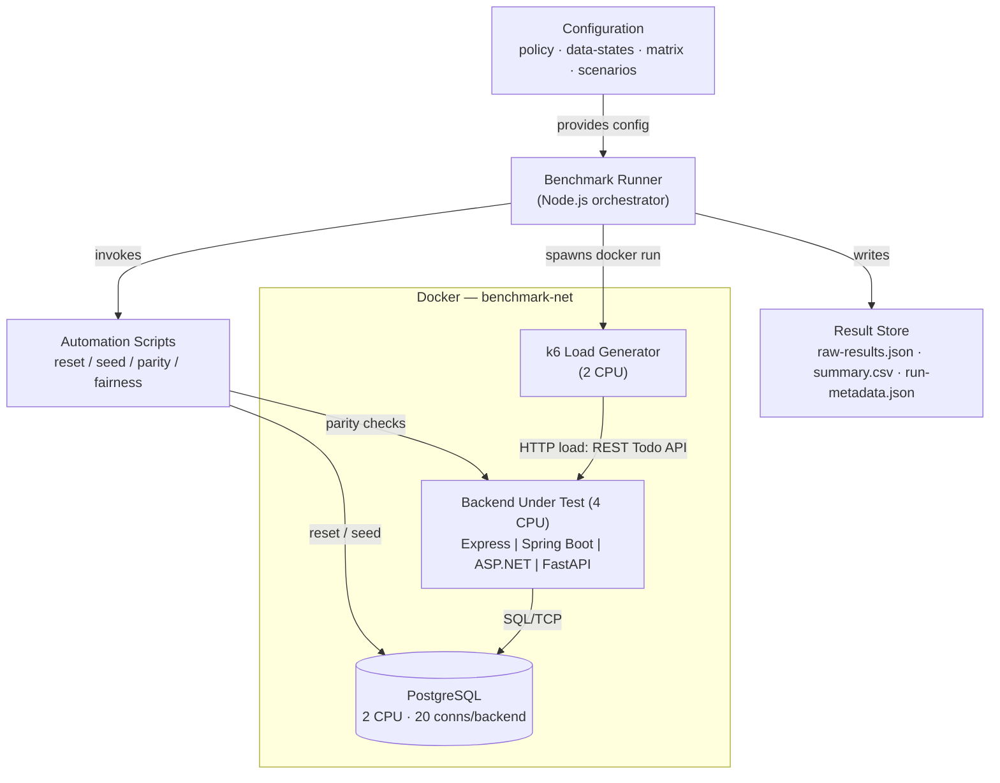
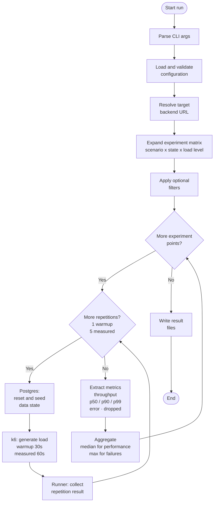

# Project Documentation

This document is the detailed technical reference for the backend benchmarking framework. It is intentionally more detailed than the top-level [`README.md`](../README.md) and is the main technical reference for the project: methodology, architecture, configuration, load models, parity verification, fairness contract, result format, design decisions, and limitations.

---

## Table of Contents

1. [Project Purpose](#1-project-purpose)
2. [System Architecture](#2-system-architecture)
3. [Backend Endpoint Mapping](#3-backend-endpoint-mapping)
4. [Benchmark Runner Workflow](#4-benchmark-runner-workflow)
5. [Project Structure](#5-project-structure)
6. [Benchmark Configuration](#6-benchmark-configuration)
7. [Benchmark Policy](#7-benchmark-policy)
8. [Data States](#8-data-states)
9. [Scenario Definitions](#9-scenario-definitions)
10. [Load Models](#10-load-models)
11. [Experiment Matrix](#11-experiment-matrix)
12. [Keyset Pagination Contract](#12-keyset-pagination-contract)
13. [Workload Generation](#13-workload-generation)
14. [Database Preparation](#14-database-preparation)
15. [Result Processing and Aggregation](#15-result-processing-and-aggregation)
16. [Result Output](#16-result-output)
17. [API Parity Verification](#17-api-parity-verification)
18. [Fairness Contract](#18-fairness-contract)
19. [Containerization and the Dockerized Load Generator](#19-containerization-and-the-dockerized-load-generator)
20. [Express Backend Example](#20-express-backend-example)
21. [Environment Preparation and Execution Rules](#21-environment-preparation-and-execution-rules)
22. [Design Decisions](#22-design-decisions)
23. [Limitations](#23-limitations)

---

## 1. Project Purpose

The purpose of this project is to provide a **reproducible benchmarking methodology** for comparing functionally equivalent REST backend implementations, applied as a case study to four frameworks that implement the same Todo API: **Express, Spring Boot, ASP.NET, FastAPI**.

The focus is the methodology, not raw numbers. The project emphasizes:

- equivalent API behavior across backends (verified before measuring)
- a controlled, production-style runtime budget for every backend (fairness contract)
- reproducible database states
- repeated measurements with a defined aggregation strategy
- a clear separation between benchmark configuration and execution
- transparent, regenerable result output

The benchmark is an **end-to-end backend benchmark**: the measured request path includes routing, validation, application logic, database access, and serialization. PostgreSQL is part of the system under test and is held constant across implementations. This is not an isolated framework-overhead microbenchmark.

It is intended to answer questions such as:

- How does performance scale with increasing concurrency (closed-model plateau)?
- At what offered request rate does a backend stop keeping up (open-model breaking point)?
- How does dataset size influence read latency and throughput?
- How do backends behave under read-heavy, write-heavy, and mixed workloads?
- How stable and reproducible are the results across repeated runs?

---

## 2. System Architecture

The benchmarking system consists of four parts:

1. **Backend implementations** — the systems under test; each implements the same REST Todo API behind the same layered design.
2. **Benchmark runner** — a Node.js orchestrator that loads configuration, prepares database states, drives the load generator, extracts and aggregates metrics, and writes results.
3. **PostgreSQL** — a shared service with a separate database per backend.
4. **Automation scripts and the Docker Compose runtime** — Compose starts the services; shell scripts handle reset, seed, parity, and fairness verification. The load generator (k6) also runs as a container.



The Mermaid diagrams above render inline; the editable PlantUML sources for the thesis figures are in [`docs/diagrams/`](diagrams).

---

## 3. Backend Endpoint Mapping

The runner resolves the target backend from the `--backend` argument. Because the load generator runs as a container on `benchmark-net`, the runner targets **container hostnames**, not `127.0.0.1`:

| Backend     | Benchmark target (container)   | Published host port (parity / manual) |
| ----------- | ------------------------------ | ------------------------------------- |
| Express     | `http://express:3001`          | `http://127.0.0.1:3001`               |
| Spring Boot | `http://springboot:8080`       | `http://127.0.0.1:8080`               |
| ASP.NET     | `http://aspnet:8081`           | `http://127.0.0.1:8081`               |
| FastAPI     | `http://fastapi:8082`          | `http://127.0.0.1:8082`               |

Implemented in `benchmark/runner/src/target-resolver.js`. Parity scripts and manual API checks use the published `127.0.0.1` ports.

---

## 4. Benchmark Runner Workflow



For each selected experiment point the runner:

1. Resets and seeds the backend database into the selected data state.
2. Executes the configured warmup runs (k6 in Docker).
3. Executes the configured measured runs (k6 in Docker).
4. Extracts throughput, latency percentiles, error rate, and dropped-iteration rate from each measured run.
5. Aggregates measured metrics (median for performance, max for failures).
6. Builds one structured experiment result.

After all points finish, the runner writes a timestamped result directory with `raw-results.json`, `summary.csv`, and `run-metadata.json`.

---

## 5. Project Structure

```text
backends/                         # Systems under test
  express/ springboot/ aspnet/ fastapi/

benchmark/
  config/
    benchmark-policy.json
    data-states.json
    experiment-matrix.json
  scenarios/
    s1-read-only-paged.json
    s2-write.json
    s3-mixed-crud.json
    s4-overload.json
    s5-overload-write.json
    s6-overload-mixed-crud.json
  runner/
    k6/
      workload.js                 # Executed inside the k6 container
    src/
      execution/
        experiment-runner.js
        repetition-runner.js
        run-k6.js                 # Spawns the k6 Docker container
      results/
        metrics.js
        aggregate.js
        result-writer.js
      config-loader.js
      db-preparer.js
      matrix-builder.js
      target-resolver.js
      index.js                    # Entry point
  results/
    validation/
    official/

db/                               # init / reset / seed SQL
scripts/                          # reset/seed, parity, fairness
docs/                             # this file, benchmark-fairness.md, diagrams/
docker-compose.yml                # Postgres + four backends on benchmark-net
```

---

## 6. Benchmark Configuration

The benchmark is controlled through JSON files rather than hardcoded runner logic:

```text
benchmark/config/benchmark-policy.json
benchmark/config/data-states.json
benchmark/config/experiment-matrix.json
benchmark/scenarios/*.json
```

Together they define the measurement policy, the available data states, the scenarios and their operation weights, and which scenario × state × load-level combinations are executed. The runner code stays generic; experiments are data. The configuration loader validates all files (e.g. scenario weights must sum to 100; matrix entries must declare a valid load model).

---

## 7. Benchmark Policy

`benchmark-policy.json` defines global measurement behavior:

| Setting               | Value      |
| --------------------- | ---------- |
| Warmup runs           | 1          |
| Measured runs         | 5          |
| Warmup duration       | 30 seconds |
| Measured duration     | 60 seconds |
| Reset before each run | true       |
| Request timeout       | 30 seconds |
| Aggregation           | median (performance), max (failures) |

Warmup runs stabilize the system (connection pools, caches, JIT) and are stored in the raw output but excluded from aggregation. The explicit per-request timeout ensures that stalled requests are counted as failures rather than hanging indefinitely — important for the open-model overload scenarios.

### Collected metrics

| Metric | Source (k6) | Meaning |
| ------ | ----------- | ------- |
| `throughput` | `http_reqs` rate | requests per second |
| `latency_median` | `http_req_duration` med | p50 latency |
| `latency_p90` | `http_req_duration` p(90) | 90th percentile latency |
| `latency_p99` | `http_req_duration` p(99) | 99th percentile latency |
| `error_rate` | `http_req_failed` | share of failed HTTP responses (non-2xx/3xx, timeouts, dropped connections) |
| `dropped_iteration_rate` | `dropped_iterations` rate | open-model only: iterations the generator could not start because all VUs were busy (load shedding) |

---

## 8. Data States

`data-states.json` defines the initial database sizes:

| State  | Rows    | ID range |
| ------ | ------- | -------- |
| empty  | 0       | none     |
| small  | 100     | 1–100    |
| medium | 10,000  | 1–10,000 |
| large  | 100,000 | 1–100,000 |

The ID range is used by the workload generator to produce valid `/todos/:id` paths and keyset cursors. A state with no ID range (e.g. `empty`) cannot be used for scenarios that require existing IDs.

---

## 9. Scenario Definitions

Scenario files define the workload composition as weighted HTTP operations summing to 100.

### S1 — Read-Only Paged (`s1-read-only-paged`, closed)

```text
80% GET /todos?limit=100&afterId={{afterId}}   (keyset-paged list)
20% GET /todos/:id                             (single-resource read)
```

The official read scenario. Collection reads use **keyset pagination**, so page cost is independent of table size and the data-state axis measures the framework, not PostgreSQL offset-scan cost.

### S2 — Write Baseline (`s2-write`, closed)

```text
100% POST /todos
```

Pure create workload. Request bodies are generated from a template:

```json
{ "title": "{{title}}", "completed": false, "order": "{{order}}" }
```

### S3 — Mixed CRUD (`s3-mixed-crud`, closed)

```text
55% GET /todos?limit=100&afterId={{afterId}}
15% GET /todos/:id
15% POST /todos
15% PATCH /todos/:id
```

A non-destructive mixed workload. `DELETE` is implemented and parity-tested but **excluded** from the measured mix: it changes resource availability mid-run, so later requests to a deleted ID return `404`, which load generators count as errors and which would distort the error-rate interpretation. All reads are bounded (keyset-paged or by-id), so results reflect request handling rather than full-table serialization.

### S4 / S5 / S6 — Open-model overload probes

These mirror the operation mix of S1 / S2 / S3 respectively, but are driven by the **open load model** (fixed request arrival rate). They exist to measure the breaking point rather than the plateau.

| Open scenario | Mirrors | Mix |
| ------------- | ------- | --- |
| `s4-overload` | S1 | 80% paged list, 20% get-by-id |
| `s5-overload-write` | S2 | 100% create |
| `s6-overload-mixed-crud` | S3 | 55/15/15/15 |

---

## 10. Load Models

Each matrix entry declares a `loadModel`. It determines the k6 executor and the numeric axis that is swept.

| Load model | k6 executor | Numeric axis | What it measures |
| ---------- | ----------- | ------------ | ---------------- |
| `closed` | `constant-vus` | `concurrency` = virtual users (connections) | Throughput plateau and latency growth. Self-throttling: each VU waits for the previous response, so the backend cannot be overloaded; `error_rate` stays ~0 by construction. |
| `open` | `constant-arrival-rate` | `arrivalRates` = target requests/second (capped by `maxVus`) | Breaking point. The offered rate is injected regardless of whether the backend keeps up. |

Why both: a closed model answers "how fast can it go and how does latency grow", but it cannot reveal saturation failures. The open model answers "how many requests per second until it breaks":

- `error_rate` rises when requests time out or return non-2xx/3xx.
- `dropped_iteration_rate` rises when k6 exhausts `maxVus` and can no longer deliver the offered rate — generator-side load shedding.

This separation directly addresses a known pitfall: under a maxed-out closed model, observed failures can be client-side timeouts rather than backend behavior. The open model plus an explicit request timeout plus the distinction between dropped iterations and HTTP errors makes overload behavior attributable to the backend.

---

## 11. Experiment Matrix

`experiment-matrix.json` defines which combinations run.

| Scenario | Load model | States | Load levels | Points |
| -------- | ---------- | ------ | ----------- | -----: |
| `s1-read-only-paged` | closed | small, medium, large | concurrency 1, 8, 32, 64, 128 | 15 |
| `s2-write` | closed | empty, small | concurrency 1, 8, 32 | 6 |
| `s3-mixed-crud` | closed | medium | concurrency 8, 32, 64 | 3 |
| `s4-overload` | open | medium | rate 1000, 2000, 4000, 8000, 16000, 32000 (maxVus 2000) | 6 |
| `s5-overload-write` | open | empty, small | rate 1000…32000 (maxVus 2000) | 12 |
| `s6-overload-mixed-crud` | open | medium | rate 1000…32000 (maxVus 2000) | 6 |

Total: **48 experiment points per backend**, **192 across four backends**. Each point runs 1 warmup + 5 measured repetitions, which makes automated execution essential. A full matrix takes roughly 4–5 hours per backend.

The matrix builder (`matrix-builder.js`) normalizes both load models into a single `loadLevel` axis (VUs for closed, req/s for open) so the rest of the pipeline is model-agnostic.

---

## 12. Keyset Pagination Contract

Official read scenarios use keyset pagination: `GET /todos?limit=100&afterId=…`, translated to `WHERE id > :afterId ORDER BY id ASC LIMIT :limit`. All backends must:

- Return the full table when **no** `limit` or `afterId` query parameter is present.
- Apply keyset pagination when **either** parameter is present.
- Default an invalid `limit` to **100**, cap a valid `limit` at **500**.
- Default an invalid `afterId` to **0**.

Keyset pagination keeps page cost O(log n) regardless of table depth, so the data-state axis does not measure offset-scan cost. The unbounded `GET /todos` remains in the API (and is parity-tested) but is not used by the benchmark scenarios. Parity scripts verify this contract against the Express reference.

---

## 13. Workload Generation

Workload generation happens inside the k6 container, driven by `benchmark/runner/k6/workload.js`. The runner passes the scenario operations and data-state metadata to k6 via environment variables. For each request the script:

- selects an operation according to its weight (weights expand into a 100-entry pool)
- resolves dynamic paths: `/todos/:id` uses a random ID in the state's `idMin…idMax`; `{{afterId}}` resolves to a random keyset cursor so each page request lands on a real, full page
- fills body templates: `{{title}}`, `{{order}}`, `{{completed}}`
- applies the configured per-request timeout

The executor (closed `constant-vus` vs open `constant-arrival-rate`) is chosen from the `loadModel` passed by the runner.

---

## 14. Database Preparation

Database preparation is handled by `benchmark/runner/src/db-preparer.js`, which resolves a backend-specific reset-and-seed script:

```text
express    → scripts/express/reset-and-seed-express-db-state.sh
springboot → scripts/springboot/reset-and-seed-springboot-db-state.sh
aspnet     → scripts/aspnet/reset-and-seed-aspnet-db-state.sh
fastapi    → scripts/fastapi/reset-and-seed-fastapi-db-state.sh
```

When `resetBeforeEachRun` is enabled, the selected backend database is reset and seeded before every warmup and every measured repetition, so each run starts from an identical logical state.

---

## 15. Result Processing and Aggregation

Relevant files: `results/metrics.js`, `results/aggregate.js`, `results/result-writer.js`.

### Extraction

Metrics are read from the k6 `--summary-export` JSON (see the metrics table in [Section 7](#7-benchmark-policy)). `dropped_iteration_rate` is only emitted by the open-model executor and is `0` for closed-model runs.

### Aggregation

Each metric is aggregated independently across the five measured repetitions:

- **Performance metrics** (`throughput`, `latency_median`, `latency_p90`, `latency_p99`) → **median**, which is robust to outliers.
- **Failure metrics** (`error_rate`, `dropped_iteration_rate`) → **max**, on purpose: a single repetition where the backend failed or the generator shed load is exactly the breaking-point signal and must not be discarded by a median.

Per-repetition values are preserved in `raw-results.json` so the aggregation choice can be re-examined.

---

## 16. Result Output

Each run creates a timestamped directory:

```text
benchmark/results/<validation|official>/<backend>/<timestamp>/
  raw-results.json     # per-repetition detail + aggregated metrics + execution metadata
  summary.csv          # one row per experiment point
  run-metadata.json    # category, backend, target URL, k6 image, network, policy, filters, timing
```

`summary.csv` columns:

```text
backend, scenarioId, stateName, loadModel, loadLevel,
throughput, latency_median, latency_p90, latency_p99,
error_rate, dropped_iteration_rate
```

`loadLevel` is the virtual-user count for closed-model rows and the target requests/second for open-model rows.

---

## 17. API Parity Verification

Before performance benchmarking, the non-Express backends are checked for strict API parity against the **Express reference**. This avoids all-pairs comparison: if each backend matches Express, they are treated as functionally equivalent.

### What is compared

- numeric HTTP status codes
- relevant response headers
- JSON response body structure and exact error messages
- malformed JSON, invalid IDs, unknown routes
- partial update (PATCH) and delete semantics
- keyset pagination semantics (`?limit=`, `?afterId=`, limit cap, invalid values, empty page, benchmark page)
- selected validation edge cases

### Deterministic setup

Each script verifies both backends are reachable, resets both databases, seeds the deterministic `small` state, captures created IDs dynamically, runs the same logical cases against both backends, normalizes irrelevant transport differences (numeric status codes, unstable headers such as `Date`, JSON content-type variants, backend-specific base URLs), and compares status, headers, and body.

```bash
./scripts/compare-express-aspnet-parity.sh
./scripts/compare-express-fastapi-parity.sh
./scripts/compare-express-springboot-parity.sh
```

Parity scripts verify **HTTP behavior only**. CPU limits, worker counts, and pool sizes are verified separately (see Section 18).

---

## 18. Fairness Contract

To keep the comparison fair, every backend runs under the same production-style runtime budget, documented in [`docs/benchmark-fairness.md`](benchmark-fairness.md) and verified by `scripts/verify-benchmark-fairness.sh`.

| Resource | Setting |
| -------- | ------- |
| Backend container | 4 CPUs |
| PostgreSQL container | 2 CPUs |
| k6 container | 2 CPUs |
| Total DB connection pool | 20 per backend |
| Network | `benchmark-net` (container-to-container) |
| Load generator image | `grafana/k6:2.0.0` |

Pool composition: Express and FastAPI run 4 workers × 5 connections; Spring Boot (Hikari) and ASP.NET use a single 20-connection pool. Production runtime flags are set per backend (`NODE_ENV=production`, `ASPNETCORE_ENVIRONMENT=Production`, FastAPI without dev docs, Spring Boot production runtime settings — tuned Hikari pool, no dev tooling).

`verify-benchmark-fairness.sh [backend|all]` checks: container `NanoCpus`, worker/process counts, pool environment/config, `benchmark-net` membership, Postgres CPU, and the presence of the k6 image. It runs in seconds and should be run after every `docker compose up --build`.

> Caveat: on Apple Silicon the cores are heterogeneous. `--cpus` is applied equally to all backends so the comparison is fair, but absolute numbers are machine-specific and should not be generalized.

---

## 19. Containerization and the Dockerized Load Generator

All backends and PostgreSQL run through Docker Compose, started outside the runner (the runner assumes the selected backend and Postgres are up).

The load generator also runs as a container: for each warmup/measured repetition, `run-k6.js` spawns `docker run --rm --network benchmark-net --cpus 2 grafana/k6:2.0.0 …`, mounts `k6/workload.js`, passes the scenario/state/load-model via environment variables, and reads back the `--summary-export` JSON. Running k6 on `benchmark-net` (rather than over published host ports) avoids Docker Desktop host-proxy latency and keeps the load path container-to-container.

---

## 20. Express Backend Example

Express is the parity reference. Its layered structure:

```text
server.js → app.js → todo-routes.js → todo-controller.js
→ todo-service.js → todo-repository.js → config/database.js → PostgreSQL
```

| Layer | Responsibility |
| ----- | -------------- |
| `server.js` | Starts the app, checks DB connectivity, handles shutdown |
| `app.js` | Configures middleware, routes, error handling |
| `todo-routes.js` | Maps endpoints to controller functions |
| `todo-controller.js` | Request/response flow |
| `todo-service.js` | Validation and business rules |
| `todo-repository.js` | SQL queries (incl. keyset pagination) |
| `config/database.js` | PostgreSQL connection pool |
| `todo-serializer.js` | DB rows → API response shape |
| `error-handler.js`, `not-found.js` | Centralized error and 404 handling |

For production load, Express runs under a cluster of workers (`WEB_CONCURRENCY=4`), each with a 5-connection pool. The other backends follow the same API contract and benchmark methodology with framework-specific internals.

---

## 21. Environment Preparation and Execution Rules

### Preparation for official runs

- close unnecessary applications; quit background CPU/IO/network consumers
- ensure Docker is running and the fairness contract passes
- allow the machine to remain otherwise idle during official runs

### Execution rules

- Run Compose and helper scripts from the **repository root** (paths resolve relative to root).
- Run backends **one at a time**, sequentially; do not bring Compose down between them, so the fairness contract stays intact.
- Use a standalone terminal with `caffeinate -dims` so a multi-hour run is not interrupted by editor closure or sleep.

```bash
# from repo root
docker compose up -d --build
./scripts/verify-benchmark-fairness.sh all

# from benchmark/runner
caffeinate -dims node src/index.js --category official --backend springboot
```

Optional filters (`--scenario`, `--state`, `--concurrency`) select a subset; `--concurrency` filters the `loadLevel` (VUs for closed, req/s for open).

---

## 22. Design Decisions

- **Configuration-driven benchmarking.** Settings are externalized into JSON for reproducibility, transparency, and extensibility.
- **Two load models.** Closed (`constant-vus`) for plateau/latency; open (`constant-arrival-rate`) for breaking point. Stress is a load dimension applied to existing workloads, not a separate scenario.
- **Median for performance, max for failures.** Robust central tendency for latency/throughput; worst-case visibility for errors and load shedding.
- **Keyset pagination.** Keeps read cost independent of table size so the data-state axis measures the framework.
- **Reset before each run.** Identical starting conditions for every repetition.
- **Express as parity reference.** Functional equivalence is established against one reference rather than all pairs.
- **Non-destructive S3.** DELETE is excluded from the measured mix to avoid expected-404 noise in the error rate.
- **Dockerized, container-to-container load.** Controlled load-generator budget and no host-proxy latency.

---

## 23. Limitations

- Results depend on the hardware and OS; absolute numbers are machine-specific (notably Apple Silicon heterogeneous cores).
- The benchmark is **end-to-end**: persistence access is part of the measured path. Results reflect comparable backend behavior under a controlled common API and persistence strategy, not isolated framework-kernel speed. The database strategy is standardized but its effects are controlled, not eliminated.
- Containerization improves consistency but does not remove all runtime differences.
- Framework-specific runtime behavior (event loop, thread pools, GC, ASGI workers) remains part of what is measured — by design.
- Load generator and backend run on the same machine; cross-process interference is reduced (CPU limits, separate containers) but not fully eliminated. A two-machine setup is future work.
- Closed-model runs cannot reveal saturation failures by construction; the open-model scenarios address this, but their breaking points are bounded by the configured arrival-rate ladder and `maxVus`.
- Results should not be generalized beyond the tested setup without caution.
